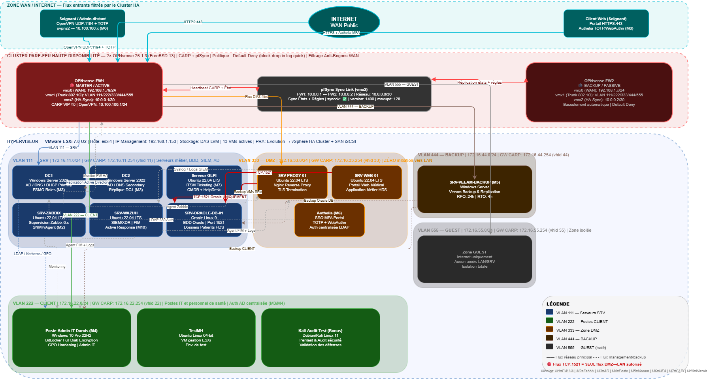

# 📂 Projet Résilience : Infrastructure HDS & Zero-Trust pour la Clinique Le Châtelet


[](https://opnsense.org)
[](https://wazuh.com)
[](https://zabbix.com)
[](https://authelia.com)
[](https://vmware.com)

[](https://esante.gouv.fr)
[](https://www.hhs.gov/hipaa)
[](https://nis2.eu)
[](https://gdpr.eu)


## 🏥 1. Contexte & Enjeux Métiers
La **Clinique Le Châtelet**, établissement de rééducation spécialisé, a dû porter son application médicale monolithique (Oracle + Node.js) sur le Web pour permettre l'accès distant sécurisé aux dossiers patients.

**Le défi :** Exposer des données de santé ultra-critiques (HDS) sur Internet tout en garantissant une disponibilité de 99.99% et une étanchéité totale face aux ransomwares.

---

## 🏗️ 2. Architecture Globale (Design Haute Disponibilité)
L'infrastructure est déployée sur un hyperviseur **VMware ESXi 7.0 U2** et repose sur un cluster de pare-feux en haute disponibilité.

### 2.1. Topologie Architecture Hybride ESXi

**Topologie** : L'architecture réelle déployée est **HYBRIDE**, combinant :
- **Router-on-a-Stick** pour les firewalls (flexibilité)
- **Groupes de ports Access** pour les VMs (simplicité)

**Principe** :

Au lieu d'une architecture pure Router-on-a-Stick où TOUTES les VMs passeraient par le trunk, j'ai créé **2 types de groupes de ports** :

1. **Type 1 : TRUNK (pour firewalls uniquement)**
   - Nom : `TRUNK_LINK-LAN`
   - VLAN ID : **4095** (Virtual Guest Tagging)
   - Fonction : Permet aux firewalls de gérer eux-mêmes les tags VLAN 802.1Q
   - VMs connectées : OPNsense-FW1, OPNsense-FW2

2. **Type 2 : ACCESS (pour toutes les autres VMs)**
   - VMs connectées directement au bon VLAN sans configuration
   - ESXi tag automatiquement les trames avec le bon VLAN ID
   - Simplification massive : VMs n'ont aucune config VLAN à faire

**Avantages architecture hybride** :
- ✅ **Simplicité** : VMs n'ont pas besoin de configurer VLAN tagging
- ✅ **Flexibilité** : Ajout/suppression VLANs se fait dans OPNsense
- ✅ **Performance** : Routage hardware-accéléré dans OPNsense
- ✅ **Sécurité** : Firewalls contrôlent tout le routage inter-VLANs
- ✅ **Scalabilité** : Meilleure que switch virtuel par VLAN

**Schéma physique** :

```
┌─────────────────────────────────────────┐
│  OPNsense-FW1 (3 vNICs physiques)       │
│  ┌────────────────────────────────────┐ │
│  │ vmx0 (WAN)         → Groupe: WAN65   │ │
│  │                      VLAN 65 Access │ │
│  │ vmx1 (Trunk_Link)     → Groupe: TRUNK │ │
│  │                      VLAN 4095 VGT    │
│  │ vmx2 (HA_SYNC)  → Groupe: HA_SYNC     │
│  │                      Untagged Access  │ │
│  └────────────────────────────────────┘ │
│                                         │
│  VLANs logiques (créés dans OPNsense) : │
│  ├── VLAN 111 (SRV)    → XX.XX.11.1   │
│  ├── VLAN 222 (CLIENT) → XX.XX.22.1   │
│  ├── VLAN 333 (DMZ)    → XX.XX.33.1   │
│  ├── VLAN 444 (BACKUP) → XX.XX.44.1   │
│  └── VLAN 555 (GUEST)  → XX.XX.55.1   │
|  └── VLAN 999 (MGMT)   → XX.XX.99.1   |
└─────────────────────────────────────────┘
```

### 2.2. Configuration ESXi sur le VMware Sphere

**Groupes de ports créés** :

| Nom groupe | VLAN ID | Fonction | Type | VMs connectées |
|------------|---------|----------|------|----------------|
| **WAN** | **65** | Accès Internet (vers Sophos) | **Access** | FW1-vmx0, FW2-vmx0 |
| **HA_SYNC** | **Aucun** | Lien direct FW1 ↔ FW2 | **Access** | FW1-vmx2, FW2-vmx2 |
| **TRUNK_LINK-LAN** | **4095** | Virtual Guest Tagging (VGT) | **Trunk** | **FW1-vmx1, FW2-vmx1** |
| **VLAN-SRV** | **111** | Serveurs infrastructure | **Access** | DC1, DC2, Oracle, Zabbix, Wazuh, GLPI |
| **VLAN-CLIENT** | **222** | Postes de travail | **Access** | Poste_Admin_durcis |
| **VLAN-DMZ** | **333** | Zone démilitarisée | **Access** | SRV-PROXY-01, SRV-WEB-01 |
| **VLAN-BACKUP**  | **444**  | Réseau sauvegarde | **Access** | SRV-VEEAM  |
| **VLAN-MGMT**  | **999**  | Gestion de serveurs | **Access** | SRV-Bastion_d'admin  |
| **VLAN-GUEST**  | **555**  | Réseau invités | **Access** | (aucune VM) |


**VLAN 4095 - Virtual Guest Tagging** :
- C'est un VLAN ID spécial VMware qui signifie : "Je laisse la VM gérer elle-même les tags VLAN"
- Le traffic 802.1Q passe en mode trunk sans être dé-taggé par ESXi
- OPNsense reçoit les trames avec leurs tags VLAN intacts et peut les router
- **Utilisé uniquement par les firewalls** pour l'interface `vmx1`


Le SI est micro-segmenté en **6 VLANs hermétiques** pour limiter la surface d'attaque et interdire les mouvements latéraux :

* **VLAN 111 (SRV) :** Cœur du métier (Oracle DB, AD DS, SIEM).
* **VLAN 222 (CLIENT) :** Postes de travail durcis et sécurisés.
* **VLAN 333 (DMZ) :** Zone d'exposition publique (Nginx, Authelia).
* **VLAN 444 (BACKUP) :** Zone sanctuarisée pour la résilience (Veeam).
* **VLAN 555 (GUEST) :** Accès Internet isolé pour les patients.
* **VLAN 999 (MGMT) :** Flux d'administration Out-of-Band.

> **Visualisation de l'architecture :**

<p align="center">
  
</p>

---

## 🔐 Flux d'authentification MFA

```
Soignant (distant)
       │
       │ HTTPS 443
       ▼
  Nginx (srv-proxy-01)
       │
       │ auth_request → Authelia
       ▼
  Authelia MFA ──LDAPS 636──► Active Directory
       │                      (DC1 + DC2)
       │ ✅ 2FA validé
       ▼
  App Node.js + index.html (srv-web-01)
       │
       │ TCP 1521
       ▼
  Oracle XE 21c (dossiers patients)
```

**Chaque accès à un dossier patient nécessite :**
1. Identifiant AD (`sAMAccountName`)
2. Mot de passe AD
3. Code TOTP (Google Authenticator / FreeOTP)

👉 *[Voir la documentation web](app/srv-web-deployment.md)* et
👉 *[Voir la documentation Oracle BD](app/oracle-db-hardening.md)*

---

## 🛡️ 3. Stack Sécurité & Conformité (L'Arsenal SecOps)

### 🔑 Identité & Accès (Zero-Trust)
Mise en place d'une passerelle d'accès sécurisée interdisant tout flux direct vers l'application :
* **Nginx Reverse Proxy :** Terminaison TLS 1.3 et filtrage des requêtes.
* **Authelia MFA :** Authentification à deux facteurs obligatoire (TOTP/WebAuthn) couplée à l'Active Directory via LDAPS.

👉 *[Voir la documentation de la politique Zero-Trust](configs/proxy/authelia-zero-trust-gateway.md)*

### 🕵️ SIEM & Détection (SOC)
Déploiement de **Wazuh** avec une couverture de 100% des agents :
* **Conformité automatisée :** Tagging natif des alertes selon les normes HIPAA 164.312, PCI-DSS et HDS.
* **Active Response (SOAR) :** Bannissement automatique des adresses IP en cas de Brute Force SSH détecté.
* **FIM (File Integrity Monitoring) :** Surveillance en temps réel des configurations critiques (`/etc/nginx`, `C:\Windows\System32`).

👉 *[Voir l'architecture SIEM avancée de Wazuh](configs/siem/wazuh-advanced-architecture.md)*

---

## 📊 4. Supervision, Alerting & Maintien en Condition Opérationnelle (MCO)

**Zabbix 7.4.9** — 5 templates actifs, 150+ métriques :

| Template | Hôtes | Métriques clés |
|----------|-------|----------------|
| Oracle by Zabbix agent 2 | srv-oracle-db-01 | 72 items (SGA, PGA, FRA, sessions) |
| Linux by Zabbix agent | srv-wazuh, srv-web-01 | CPU, RAM, disk, réseau |
| Nginx by Zabbix agent active | srv-proxy-01 | Connexions, requêtes, statuts |
| Network Generic Device SNMP | FW1, FW2 | Interfaces, trafic |
| Windows by Zabbix Agents | DC1, DC2, Veeam backup & Poste-admin_Win10 | CPU, RAM, disk, réseau |

**Pipeline d'alerting :**
```
Zabbix → Postfix (srv-wazuh) → Mailpit (srv-proxy-01:1025)
```
500+ alertes reçues — actions configurées : CRITIQUE, DISASTER, HA CARP, Sécurité Auth.

La disponibilité est monitorée par **Zabbix**.
* **Monitoring Applicatif :** Surveillance profonde de la base **Oracle 21c** (états des tablespaces, sessions actives via compte de service `C##ZBX_MONITOR`).
* **Alerting temps réel :** Remontée d'alertes via SMTP local (Mailpit) avec templates HTML structurés pour une remédiation rapide.

👉 *[Voir la stratégie d'alerte Zabbix SMTP](configs/monitoring/zabbix-alerting-strategy.md)*

---

## 💾 5. Résilience & PRA (Plan de Reprise d'Activité)
La protection des données HDS repose sur **Veeam Backup & Replication**.
* **Sanctuarisation :** Le serveur Veeam réside dans un VLAN isolé, inaccessible depuis le LAN, pour prévenir le chiffrement des sauvegardes par ransomware.
* **Backup Agentless :** Utilisation des APIs VMware vSphere pour des clichés instantanés (Snapshots) avec Change Block Tracking (CBT).
* **Base de données :** Migration sur PostgreSQL 17 pour des performances de catalogue accrues.

👉 *[Voir la documentation avancée du PRA](configs/backup/veeam-resilience-pra.md)*

---

## 🛠️ 6. Compétences Démontrées

| Domaine | Technologies maîtrisées |
| :--- | :--- |
| **Réseau** | OPNsense (CARP/pfSync), VLANs 802.1Q(Router-on-Stick), NAT, Routage Statique |
| **Sécurité** | Wazuh (SIEM), Authelia (MFA), Nginx (Proxy), OpenVPN, Suricata (IDS/IPS) |
| **Systèmes** | Windows Server 2022 (AD/DNS/GPO), Ubuntu 22.04, Oracle Linux 9 |
| **Data** | Oracle 21c XE (DBA, SQL*Net, Tablespaces), PostgreSQL |
| **DevOps** | Node.js (API Backend), Systemd, Bash Scripting, Markdown Documentation |


## 🚀 Points Forts du Projet

**Ce qui différencie cette infrastructure :**

- **Double firewall CARP** — basculement automatique FW1→FW2, RTO < 10s
- **MFA sur dossiers patients** — aucun accès sans TOTP, tracé dans Wazuh
- **+30 règles SIEM custom HDS** — HIPAA 164.312.x taggé automatiquement
- **Segmentation VLAN stricte** — DMZ isolée, BACKUP inaccessible depuis CLIENT
- **Pipeline d'alerting complet** — 500+ alertes Zabbix traitées en production
- **Matrices de conformité** — HDS · NIS2 · RGPD · HIPAA · PCI-DSS documentés
- **Résilience & PRA** -- Continuité de services en cas d'incident 


---

## 📁 7. Structure du Repository

```text
.
├── app/               # Code source de l'App Node.js et durcissement Oracle
├── architecture/      # Schémas techniques
├── configs/           # Fichiers de configuration durcis et anonymisés
│   ├── firewall/      # OPNsense HA & VLANs Setup
│   ├── monitoring/    # Zabbix Tuning & Alerting
│   ├── proxy/         # Nginx & Authelia Zero-Trust policies
│   └── siem/          # Wazuh Rules & FIM policies
├── screenshots/       # Preuves visuelles (Dashboards, MFA, Alerts)
└── README.md          # Vous êtes ici
```
📬 Contact

Steeve WOMO TCHINDA

🎓 Étudiant Mastère Cybersécurité et Cloud

🔭 En recherche d'alternance pour Septembre 2026

🔗 **LinkedIn :** [](https://www.linkedin.com/in/steeve-womo/) | 📧 **Email :** [](mailto:womo.steeven@gmail.com)
