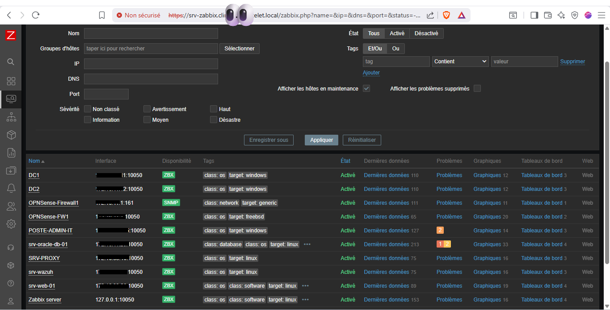

# Preuve de Concept : Supervision Proactive & Sécurité (Zabbix)

Dans le cadre du maintien en condition opérationnelle (MCO) de l'infrastructure de la Clinique Le Chatelet, la supervision ne se limite pas à un simple "ping". Le serveur Zabbix centralise les métriques systèmes, réseaux et applicatives (Oracle DB, Veeam, Nginx) tout en respectant les contraintes d'isolation.

## 1. État du Service et Versioning
Le socle de supervision repose sur la version LTS/Stable de Zabbix, garantissant un support à long terme.

```bash
zabbix_admin@srv-zabbix:~$ zabbix_server -V | head -n 1
zabbix_server (Zabbix) 7.4.9

zabbix_admin@srv-zabbix:~$ systemctl status zabbix-server | grep "Active:"
     Active: active (running) since Tue 2026-05-12 19:31:27 CEST; 20h ago
```
## 2. Hardening et Optimisation du Serveur (zabbix_server.conf)
La configuration du serveur a été épurée et durcie. Plutôt que d'utiliser les paramètres par défaut, des ajustements spécifiques ont été appliqués pour la sécurité et la performance de la base de données.

```Ini, TOML
LogFile=/var/log/zabbix/zabbix_server.log
PidFile=/run/zabbix/zabbix_server.pid
SocketDir=/run/zabbix

# [SECURITE] Interdiction d'exécuter des scripts globaux depuis l'interface Web
# Prévient les attaques par exécution de code à distance (RCE) en cas de compromission d'un compte Zabbix admin.
EnableGlobalScripts=0

# [PERFORMANCE] Tolérance réseau ajustée pour les vérifications distantes
Timeout=4

# [DATABASE TUNING] Journalisation des requêtes lentes pour le diagnostic de la base PostgreSQL/MySQL
LogSlowQueries=3000

# [SECURITE] Restriction de la consultation des statistiques internes au localhost
StatsAllowedIP=127.0.0.1
```
## 3. Déploiement des Agents Zabbix
Le monitoring des machines internes (VLAN_SRV, VLAN_DMZ) s'effectue de manière sécurisée. Les agents sont restreints pour n'accepter les requêtes que du serveur Zabbix officiel, limitant ainsi la surface d'attaque.

```Ini, TOML
# /etc/zabbix/zabbix_agentd.conf (Exemple sur l'agent local)
Server=<IP_SRV_ZABBIX>
ServerActive=<IP_SRV_ZABBIX>
Hostname=<NOM_DU_SERVEUR_SUPERVISE>
```

---

>Note de conception : Sur les équipements ne pouvant pas recevoir d'agent (ex: pares-feux OPNsense, Switchs), la supervision est réalisée via SNMPv3 avec chiffrement et authentification forte, conformément aux recommandations de l'ANSSI.

<p align="center">
  
</p>
